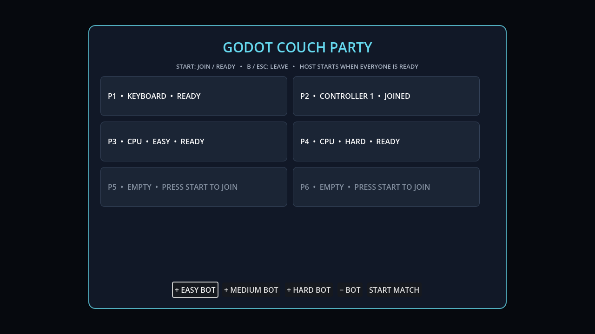

# Godot Couch Party

Godot Couch Party is a small, runtime-only Godot 4 addon for building local multiplayer games with up to six human and bot participants. It handles the infrastructure that couch games repeatedly need while leaving combat, scoring, spawning, and bot intelligence inside the game.



## Features

- Stable controller-to-player assignments for two to eight slots, with six by default
- One keyboard player by default, with optional additional keyboard layouts
- Join, leave, ready, disconnect, reconnect, and capacity behavior
- Human, bot, and empty slots with Easy, Medium, and Hard bot metadata
- Event-driven controller input that never merges different joypads
- Semantic movement, aim, primary, secondary, tertiary, menu, and cancel fields
- Configurable controller buttons, keyboard layouts, and stick deadzone
- Buffered press edges that survive render-to-physics timing
- Reusable six-slot join/ready lobby with bot controls
- Headless public-interface tests and a runnable example project

Godot Couch Party does not implement online multiplayer, game rules, character spawning, scoring, or bot AI.

## Requirements

- Godot 4.7 or later
- GDScript build; no native extension or third-party dependency

Earlier Godot 4 releases may work, but the initial release is verified against Godot 4.7.

## Installation

Copy the `addons/couch_party/` folder into the `addons/` folder of your project:

```text
your_game/
  addons/
    couch_party/
```

This is a runtime library, so there is no editor plugin to enable.

## Quick start

```gdscript
extends Node

const PartySession := preload("res://addons/couch_party/core/party_session.gd")
const InputRouter := preload("res://addons/couch_party/input/device_input_router.gd")
const PartyLobby := preload("res://addons/couch_party/ui/party_lobby.gd")

var party := PartySession.new()
var input_router := InputRouter.new()
var lobby: Control


func _ready() -> void:
    lobby = PartyLobby.new()
    add_child(lobby)
    lobby.setup(party, input_router, {"title": "LOCAL BATTLE"})
    lobby.start_requested.connect(_start_match)
    Input.joy_connection_changed.connect(lobby.device_connection_changed)


func _input(event: InputEvent) -> void:
    if not lobby.visible:
        input_router.ingest(event)


func _physics_process(_delta: float) -> void:
    if lobby.visible:
        return
    for player_id: int in party.human_player_ids(true):
        var device_id: int = party.device_for_player(player_id)
        var frame: Dictionary = input_router.frame_for_device(device_id)
        # Adapt frame to the command shape used by your simulation.


func _start_match(roster: Dictionary) -> void:
    lobby.close()
    # Spawn one game-owned actor for each roster entry.
```

The included example can be opened directly as a Godot project. Press Enter or controller Start to join and ready. A ready participant can start once the roster contains at least two participants and every human is ready.

## Input frames

`frame_for_device(device_id)` returns:

```gdscript
{
    "move": Vector2,
    "aim": Vector2,
    "primary_pressed": bool,
    "primary_held": bool,
    "secondary_pressed": bool,
    "secondary_held": bool,
    "tertiary_pressed": bool,
    "tertiary_held": bool,
    "menu_pressed": bool,
    "menu_held": bool,
    "cancel_pressed": bool,
    "cancel_held": bool,
}
```

The default controller convention is left stick movement, West/X primary, South/A secondary, North/Y tertiary, Start menu, and East/B cancel. The default keyboard convention is WASD, E, Space, Q, Enter, and Escape.

Press fields are consumed once per device. Held fields remain true until a release event is ingested. Call `clear_device()` or `clear_all()` at scene and pause transitions to prevent input leakage.

## Custom input profiles

```gdscript
const InputProfile := preload("res://addons/couch_party/input/input_profile.gd")

var profile := InputProfile.new({"deadzone": 0.18})
profile.set_controller_bindings({
    "primary": JOY_BUTTON_A,
    "secondary": JOY_BUTTON_X,
    "tertiary": JOY_BUTTON_Y,
    "menu": JOY_BUTTON_START,
    "cancel": JOY_BUTTON_B,
})
profile.add_keyboard_layout(-2, {
    "move_left": KEY_LEFT,
    "move_right": KEY_RIGHT,
    "move_up": KEY_UP,
    "move_down": KEY_DOWN,
    "primary": KEY_PERIOD,
    "secondary": KEY_SLASH,
    "tertiary": KEY_COMMA,
    "menu": KEY_ENTER,
    "cancel": KEY_BACKSPACE,
})

var input_router := InputRouter.new({"profile": profile})
var party := PartySession.new({"keyboard_device_ids": profile.keyboard_device_ids()})
```

Negative IDs represent synthetic keyboard layouts. Non-negative IDs are Godot joypad device IDs. Bots do not receive fake device IDs; they are first-class roster occupants.

## Architecture

The addon exposes three focused modules:

- `CouchPartySession` owns roster identity and readiness.
- `CouchPartyInputRouter` translates physical events into isolated semantic frames.
- `CouchPartyLobby` composes the session, router, and reusable lobby view.

A game adapts semantic input frames into its own simulation commands and interprets bot metadata using its own bot controllers. This keeps the addon reusable without importing game-specific rules.

## Verification

```sh
./tools/verify.sh
```

The verifier imports every script, exercises party lifecycle, input isolation, lobby rendering and interaction, then boots the example project.

GitHub Actions runs the same verification on every push and pull request. To build the distributable Asset Store archive:

```sh
./tools/package.sh
```

Release and listing details are in [docs/ASSET_STORE.md](docs/ASSET_STORE.md).

## Publishing and AI disclosure

The project is MIT licensed and structured for distribution as a Godot Asset Store Addon. Generative AI assistance was used during initial implementation, testing, documentation, and review; this should be disclosed on the Asset Store listing.

## License

[MIT](LICENSE) © 2026 Domagoj Satrapa
